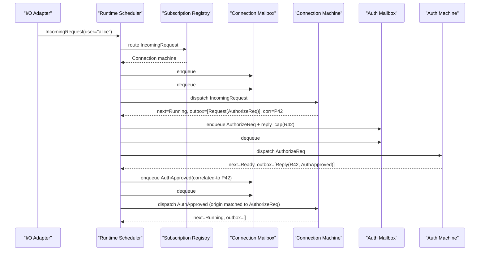

# Typestate Machines: Async Events + Protocol Transitions (Draft)

## Status

Draft proposal, revised after external design review.

This extends the existing typestate prototype (`--experimental typestate`) while
avoiding function-coloring (`async fn`/`await`).

## Terminology

- `typestate`: source-level definition of states and transitions.
- `machine`: runtime instance of a typestate.
- `protocol`: abstract interaction contract.
- `role`: one side of a protocol.
- `transition`: directional protocol rule inside a protocol role/state.

## Review-Driven Decisions

The following are adopted as baseline constraints for this design:

1. Correlation-by-convention is rejected.
2. Managed mode is mailbox-only.
3. Handler semantics are transactional (defined below).
4. V1 conformance scope is explicit: **Shape** only.
5. Typed handles are preferred over raw machine ids at source level.
6. Typestate-level default handlers are supported to control error explosion.

## Semantic Freeze (V1 Source of Truth)

This section is the normative contract for implementation work. If later
sections conflict with this one, this section wins.

### Frozen Invariants

1. **Managed-mode exclusivity**
   - registering a machine in managed mode consumes direct ownership.
   - direct typestate transition calls on that managed instance are illegal.
2. **Dispatch model**
   - handlers are synchronous, run-to-completion, one-at-a-time per machine.
   - runtime dispatch is mailbox-driven only in managed mode.
3. **Transactional semantics**
   - commit unit is `(next state, outbox effects, subscription updates)`.
   - if handler fails before successful completion, commit does not occur.
4. **Default handler precedence**
   - state-local handler first.
   - typestate-level handler only as fallback when state-local is absent.
5. **Handle/capability surface**
   - source-level addressing uses typed machine handles (`Machine<T>`).
   - correlation is implicit by default; no raw correlation ids in source.
   - `Pending<RespSet>`/`ReplyCap<RespSet>` remain available as explicit
     advanced control forms.
   - source code must not manually construct correlation ids.
6. **Reply linearity baseline**
   - request handlers expose an implicit reply capability by default.
   - on successful paths, exactly one reply must be produced.
   - explicit `ReplyCap<RespSet>` binding (when used) remains linear and
     exactly-once on successful paths.
   - v1 has no no-reply escape hatch (`@no_reply` is out of scope).
7. **Protocol conformance scope**
   - v1 enforces shape only.
   - stronger protocol refinement/projection checks are explicitly deferred.
8. **Pattern handler determinism**
   - multiple handlers for the same event selector are allowed only when their
     response patterns are non-overlapping.
   - pattern-form handlers are syntax sugar over one canonical handler body.
   - when response provenance is ambiguous, `for RequestType(binding)` is
     required for deterministic dispatch.

### Explicit Deferrals (Not Blocking V1)

1. Sequential/projection protocol checking beyond shape.
2. Typed channels as a first-class alternative to capability reply tokens.
3. Cross-process/distributed transport guarantees.
4. No-reply annotations and policy customization.

## Problem

Current typestate is great for direct local transitions (`c.connect()`), but we
also need long-lived machines that react to async external and inter-machine
stimuli.

We need that without splitting programs into sync/async worlds.

## Goals

1. Keep handlers synchronous and run-to-completion.
2. Support mailbox-driven managed machines.
3. Support inter-machine communication with protocol contracts.
4. Preserve direct typestate mode for local deterministic code.

## Non-Goals (V1)

1. No general async/await language feature.
2. No full session-type refinement/projection checks.
3. No distributed transport guarantees.

## Design Principle

**Asynchrony lives at the machine boundary, not inside handlers.**

Machine handler model:

`(state, incoming envelope) -> transition result`

where transition result includes next state, emitted effects, or error.

## Core Language Model

### Payloads remain regular types

No heavyweight `message` feature in v1. Protocols use lightweight `msg` entries.

```machina
type AuthorizeReq = { user: string }
type AuthApproved = {}
type AuthDenied = {}
```

### Protocols use roles + state transitions

Protocols use role-local states with explicit incoming triggers and outgoing
effects.

```machina
protocol Auth {
    msg Start
    msg AuthorizeReq = { user: string }
    msg AuthApproved
    msg AuthDenied
    req Client -> Server: AuthorizeReq => AuthApproved | AuthDenied

    role Client {
        state Idle {
            on Start -> Awaiting {
                effects: [ AuthorizeReq ~> Server ]
            }
        }
        state Awaiting {
            on AuthApproved@Server -> Ready;
            on AuthDenied@Server -> Idle;
        }
    }

    role Server {
        state Ready {
            on AuthorizeReq@Client -> Ready {
                effects: [ AuthApproved ~> Client ]
            }
        }
    }
}
```

### Typestate implements protocol role(s)

```machina
typestate Gateway : Auth::Client { ... }
typestate AuthService : Auth::Server { ... }
```

## Conformance Scope (V1)

V1 checks **Shape conformance** only:
- required incoming transition triggers have handlers,
- outgoing `Send`/`Request`/`Reply` obey protocol transition message contracts.

Not in v1:
- coverage/exhaustiveness across all reachable states for all async conditions,
- formal refinement against projected role FSM.

## Event Handling Model

### State-scoped handlers

```machina
state Connected {
    on IncomingRequest(req) {
        ...
    }
}
```

### Implicit same-state transition

Inside `state S`, omitting `-> ...` means the handler remains in `S`.

This is shorthand for the common case and avoids repetitive explicit
same-state transition returns.

### Same-type payload shorthand

For handlers where selector and payload type are the same:

- `on Ping(p: Ping) { ... }` can be written as `on Ping(p) { ... }`.
- `on Ping { ... }` is allowed when payload is unused.

### Response provenance with `for`

For response events, handlers can bind the originating request payload using
`for RequestType(binding)`:

```machina
state AwaitAuth {
    on AuthApproved(ok) for AuthorizeReq(req) -> Connected {
        Connected
    }

    on AuthDenied(err) for AuthorizeReq(req) -> Closing {
        Closing
    }
}
```

Canonical meaning (conceptual desugar):

```machina
on Response(resp: AuthApproved | AuthDenied, origin: AuthorizeReq) -> Connected | Closing {
    match (resp, origin) {
        (AuthApproved(ok), AuthorizeReq(req)) => Connected,
        (AuthDenied(err), AuthorizeReq(req)) => Closing,
    }
}
```

In the common case where origin details are not needed, `for ...` is optional
and correlation remains implicit.

### Typestate-level default handlers

Catch-all handlers can be declared at typestate scope to avoid per-state
boilerplate for cross-cutting failures.

```machina
typestate Connection {
    on WriteFailed(err: WriteFailed) -> Closing {
        Closing
    }
}
```

(Exact precedence rules are specified below.)

### Default Handler Precedence

For the same incoming payload kind:
1. state-local `on` handler is selected first,
2. typestate-level default `on` handler is used only if no state-local handler exists.

## Send / Request / Reply

Proposed primitives:

- `send(to: Machine<T>, Payload { ... })`
- `request(to: Machine<T>, Req { ... })`
- `reply(Resp { ... })`

For app-facing managed handles, ergonomic wrappers are also part of v1:
- `handle.send(payload) -> () | MachineError`
- `handle.request(payload) -> u64 | MachineError` (default implicit-correlation form)

Canonical lower-level forms (`emit Send(...)`, `emit Request(...)`,
`reply(cap, ...)`) remain available for advanced/internal usage.

### Typed request/reply safety

To avoid raw `corr: u64` bugs, request/reply uses compiler/runtime-managed
correlation and capabilities:

- responders get an implicit reply capability in request handlers.
- `reply(x)` requires `type(x)` in the allowed response set for that request contract.
- when explicit `ReplyCap<RespSet>` is bound, `reply(cap, x)` is also valid.
- reply capability must be consumed exactly once on all successful paths.
- source-level code does not manually construct/compare correlation ids.

This is the v1 pragmatic alternative to full typed channels.

## Direct vs Managed Modes

Two modes coexist:

1. `Direct mode`: existing local value transitions (`c.connect()`).
2. `Managed mode`: runtime-owned machine, mailbox/event driven.

### Managed registration rule

Registering a machine in managed mode is consuming:
- source handle becomes managed mailbox endpoint,
- direct transition calls on that managed instance are disallowed.

This prevents bypassing ordering and protocol semantics.

## Runtime Architecture (Managed Mode)

Per process:
- machine table (`MachineId -> state payload + lifecycle`)
- subscription registry (`event kind + routing key -> machine id`)
- per-machine bounded FIFO mailbox
- ready queue (machine ids)
- effect executor
- dead-letter/fault hooks

Source-level APIs should use typed handles:

```text
Machine<Typestate>
```

Raw `MachineId` remains runtime/internal plumbing.

Lifecycle model (V1):
- `Created`: machine exists and may buffer mailbox messages, but is not dispatchable.
- `Running`: dispatchable.
- `Faulted`: quarantined after handler fault.
- `Stopped`: explicitly halted; runtime eagerly cleans up per-machine resources
  (mailbox contents/storage, machine-owned subscriptions, dispatch bindings).
  Machine id remains reserved so stale handles keep deterministic `NotRunning`
  behavior.

Start semantics (V1):
- `spawn` creates in `Created`.
- `start` transitions `Created -> Running`.
- if messages were buffered while `Created`, `start` schedules machine on ready queue.

## Envelope Model

```text
Envelope {
  dst: MachineId,
  src: Option<MachineId>,
  payload_kind: KindId,
  payload: bytes/value,
  reply_cap: Option<ReplyCapId>,
  routing: Option<RoutingKey>
}
```

## Transactional Handler Semantics

A single handler dispatch executes as one transition transaction:

1. Load current state.
2. Run handler.
3. If handler succeeds:
   - commit state transition,
   - commit outbox effects,
   - update subscriptions.
4. If handler faults/errors before successful completion:
   - do not commit outbox effects from that dispatch,
   - state remains pre-dispatch (or transitions to configured fault state),
   - runtime applies fault policy.

This prevents half-applied transitions.

## Ordering and Delivery Guarantees (V1)

1. One event at a time per machine.
2. FIFO per receiver mailbox.
3. No global order guarantee across different senders.
4. Bounded mailbox by default.
5. `send/request` returns typed delivery/backpressure errors.

## Inter-Machine Example (Role-Based)

```machina
type IncomingRequest = { user: string }
type AuthorizeReq = { user: string }
type AuthApproved = {}
type AuthDenied = {}

protocol Auth {
    msg Start
    msg IncomingRequest = { user: string }
    msg AuthorizeReq = { user: string }
    msg AuthApproved
    msg AuthDenied
    req Client -> Server: AuthorizeReq => AuthApproved | AuthDenied

    role Client {
        state Running {
            on IncomingRequest@System -> Running {
                effects: [ AuthorizeReq ~> Server ]
            }
            on AuthApproved@Server -> Running;
            on AuthDenied@Server -> Closing;
        }
        state Closing;
    }

    role Server {
        state Ready {
            on AuthorizeReq@Client -> Ready {
                effects: [ AuthApproved ~> Client ]
            }
        }
    }
}

typestate Connection : Auth::Client {
    fields { auth: Machine<AuthService> as Server }

    fn new(auth: Machine<AuthService>) -> Running {
        Running { auth: auth }
    }

    state Running {
        on IncomingRequest(req) {
            request(self.auth, AuthorizeReq { user: req.user });
        }

        on AuthApproved(ok) for AuthorizeReq(origin) {
            ok;
            origin;
            Running
        }

        on AuthDenied(err) for AuthorizeReq(origin) -> Closing {
            err;
            origin;
            Closing
        }
    }

    state Closing {}
}

typestate AuthService : Auth::Server {
    fn new() -> Ready { Ready }

    state Ready {
        on AuthorizeReq(req) {
            if req.user == "alice" {
                reply(AuthApproved);
            } else {
                reply(AuthDenied);
            }
        }
    }
}
```

Notes:
- Syntax above is proposal-level.
- Correlation is implicit by default; `for` exposes origin payload when needed.
- `Pending<...>` and explicit `ReplyCap<...>` remain linear capability-like
  advanced forms.

## Runtime Sequence (Inter-Machine)



## Failure and Fault Policy (V1 Draft)

Default policy:
- log fault diagnostics,
- mark machine `Faulted`,
- stop further dispatch for that machine.

Note:
- source-level managed API does not expose restart; low-level runtime lifecycle
  overrides are test/runtime-internal control paths.

Required runtime hooks:
- dead-letter callback
- mailbox overflow/backpressure callback
- machine fault callback

## Compiler Pipeline Impact

The concrete phased implementation plan is defined in
**V1 Implementation Plan (Actionable)** below. This section stays as an
architecture summary:

1. Extend frontend surface (`protocol`/`msg`/`role`/`state`/`req`, `on`, `Request`, `reply`).
2. Enforce shape conformance and capability linearity in typecheck/semck.
3. Lower managed machine operations to explicit runtime-facing operations.
4. Integrate managed runtime dispatch, envelopes, and effect execution.
5. Keep backend mostly unchanged by lowering these concerns before codegen.

## Diagnostics (Planned)

- duplicate `on` for same `(state, payload)`
- overlapping pattern-form `on` handlers for same selector
- ambiguous response provenance requiring explicit `for RequestType(binding)`
- missing required protocol transition handler for role conformance
- invalid `Send/Request` target role or payload type
- invalid `reply(...)` payload for request response set
- `reply` capability not consumed on all paths
- `reply` capability consumed multiple times
- managed machine used via direct call path
- mailbox full / delivery failure surfaced at call site

## Deferred Questions (Post-V1)

The following are intentionally deferred and non-blocking for v1:

1. Should optional request-site labels be added when multiple same-type inflight
   requests become difficult to disambiguate with `for` alone?
2. Should minimal sequential protocol progression syntax be introduced in v1.1?
3. What is the exact migration path from capabilities to typed channels?

## Future Direction: Typed Channels

Typed channels remain a strong long-term direction. This proposal intentionally
starts with capability-based request/reply as a lower-risk step that preserves
the same core benefit: correlation is structural, not convention-based.

## V1 Implementation Plan (Actionable)

This plan assumes we implement a local-process, single-scheduler runtime first.

### Milestone 0: Semantic Freeze (Must Complete First)

Output of this milestone is the **Semantic Freeze (V1 Source of Truth)** section
above. All later milestones must conform to it.

1. Lock source surface included in v1:
   - `protocol`, `msg`, `role`, `state`, `req`
   - typestate `on` handlers
   - handler shorthand (`on Ping(p)`, `on Ping`)
   - implicit same-state handlers (omitted `-> ...`)
   - `for RequestType(binding)` response provenance form
   - ergonomic `send/request/reply` forms
2. Lock capability types and linearity rules:
   - `Machine<T>` handles
   - implicit runtime correlation model
   - `Pending<RespSet>` and `ReplyCap<RespSet>` as advanced explicit forms
3. Lock handler transaction semantics (commit/rollback/fault transitions).
4. Lock managed-mode exclusivity rule (no direct calls on managed machine).
5. Lock default handler precedence (state-local before typestate-level default).
6. Lock no-reply baseline (v1 requires exactly-one reply on successful paths).

### Milestone 1: Frontend + Static Rules (No Runtime Yet)

1. Parser/AST:
   - add protocol/msg/role/state/transition nodes
   - add `on` handler nodes
   - add pattern-form `on` response handlers and desugar to canonical handler form
   - add `Send/Request/reply` expression/statement nodes
2. Resolver:
   - resolve role paths (`Auth::Client`)
   - bind transition trigger/effect message contracts and request contracts
   - bind typestate-role implementations
3. Typecheck/Semck:
   - shape conformance checks for required incoming protocol transitions
   - `Send/Request` payload legality checks by role/state transition contracts
   - `reply` payload type-in-response-set checks
   - linear capability checks (`ReplyCap` single-consume, all paths)
   - provenance disambiguation checks for `for` response handlers
4. Diagnostics:
   - add dedicated error codes for transition mismatch, reply misuse, linearity errors.
5. Tests:
   - parser golden tests
   - resolve/typecheck conformance tests
   - negative tests for each diagnostic class.

### Milestone 2: Managed Runtime Core

1. Runtime data model:
   - machine table + lifecycle (`Created | Running | Faulted | Stopped`)
   - bounded per-machine mailbox
   - ready queue
   - dead-letter/fault hooks
2. Dispatch engine:
   - dequeue + run-to-completion dispatch
   - transactional commit of state + outbox + subscription updates
3. Driver wiring:
   - runtime APIs for spawn/start/send/poll
   - compile-time lowering target for managed-machine operations
4. Tests:
   - deterministic single-machine dispatch ordering
   - bounded mailbox backpressure behavior
   - transactional rollback on handler fault.

### Milestone 3: Inter-Machine Request/Reply

1. Envelope plumbing for machine-to-machine delivery.
2. `Request` lowering:
   - create `Pending` token at caller
   - create `ReplyCap` token at callee dispatch context
3. `reply` lowering:
   - consume `ReplyCap`
   - emit routed response envelope back to requester
4. Pending-response dispatch:
   - map response envelopes to waiting machine handlers
   - enforce token matching semantics
5. Tests:
   - happy-path request/reply
   - wrong-type reply rejection at compile time
   - missing reply and double-reply path errors
   - destination missing/faulted delivery behavior.

### Milestone 4: Integration Hardening

1. LSP/analysis diagnostics parity for new syntax and checks.
2. Dump/trace support for machine transitions, queue depth, effect outcomes.
3. Documentation:
   - user-facing typestate async/protocol guide
   - examples for direct mode vs managed mode and inter-machine protocol transitions.
4. Regression suite:
   - compile-only protocol fixtures
   - runtime integration fixtures for mailbox and reply capability semantics.

### Implementation Order in Repo

1. `src/core/parse/*` and tree model updates.
2. `src/core/resolve/*` symbol binding and role references.
3. `src/core/typecheck/*` + `src/core/semck/*` conformance + linear capability checks.
4. `src/core/elaborate/*` lowering to explicit runtime-facing operations.
5. runtime crate support (`runtime/*`) and driver integration (`src/driver/*`).
6. analysis/LSP surface updates (`src/services/*`, `tooling/lsp/*`).

### Definition of Done for V1

1. Compiler accepts valid role/state-transition/handler/reply programs and rejects invalid ones with specific diagnostics.
   (using role/state transition protocol contracts + directional request contracts)
2. Managed machines run with deterministic per-mailbox FIFO dispatch and bounded queues.
3. Request/reply correlation is enforced structurally via capabilities, not user-managed ids.
   - default source model is implicit correlation with optional explicit `for`
     provenance binding.
4. Direct typestate mode remains unchanged for non-managed code paths.
5. Example suite demonstrates:
   - single-machine async event handling,
   - two-machine protocol request/reply,
   - fault handling behavior.
